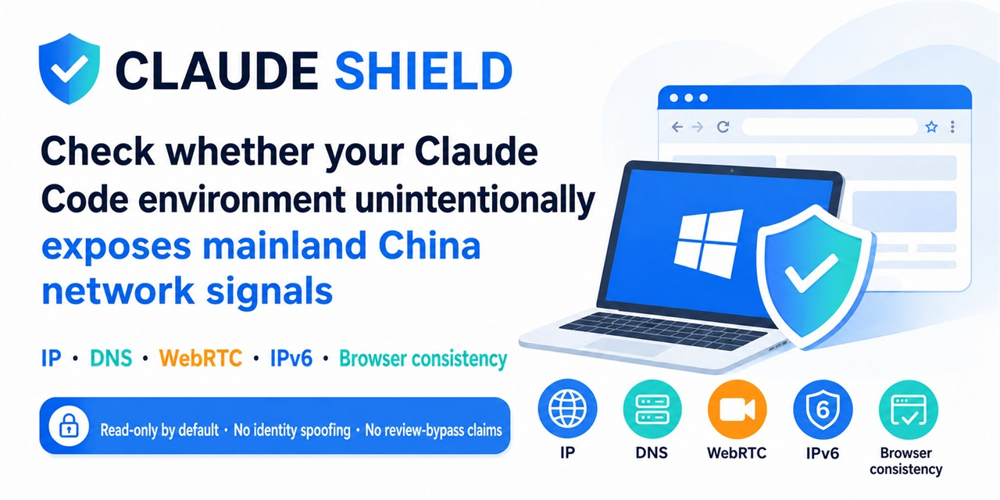

<p align="center">
  
</p>

<h1 align="center">Claude Shield</h1>

<p align="center"><strong>Local-first privacy and proxy-consistency audit for Claude Code and Agent Skills hosts.</strong></p>

<p align="center">
  
  
  
</p>

<p align="center"><a href="README.zh-CN.md">简体中文</a> · <a href="SKILL.md">Skill instructions</a> · <a href="LICENSE">MIT License</a></p>

> **How is your Claude account doing lately?**
>
> It's probably not bad luck — it's the road your traffic takes. You think everything goes through your proxy, but actually: DNS quietly falls back to your home broadband, a "backup tunnel" connects directly without the proxy, a small WebRTC backdoor lets websites see your real network address, or your proxy node randomly hops between countries at 3am.
>
> **Every one of these leaks tells the platform "something's off."** Accounts get flagged, challenged, even banned — often not because of what you say, but because of these details exposing you.
>
> Claude Shield is the tool that checks those details for you — **a read-only checkup that touches nothing**:
>
> - **Network egress**: where does your traffic actually leave from, and is anything bypassing the proxy?
> - **DNS resolution**: does a simple lookup secretly detour somewhere it shouldn't?
> - **Proxy setup**: are your nodes auto-hopping, are your rules silently broken?
> - **System state**: do your timezone, language, and privacy toggles contradict each other?
>
> When the checkup finishes, you get a **clear report** — every item labeled: **Must fix** (a real problem), **Optional consistency** (not a risk, but worth aligning), **Leave alone** (don't touch it).
>
> Then the decision is **entirely yours** — nothing changes without your explicit approval.
>
> And here's what this tool **won't do**:
>
> - It won't help you **impersonate someone else** (no fingerprint spoofing, no hiding automation)
> - It won't help you **fabricate identity** (no fake addresses, billing, or personal info)
> - It will never **guarantee** "this config means you'll never get banned" — anyone who promises that is lying to you.
>
> The "anti-ban" tools teach you to fool the platform. Claude Shield does one thing: **show you the truth**, and give you back the choice.
>
> **Audit first. Decide after.** Your account deserves one honest check.

## Install

```powershell
git clone https://github.com/AschoofAlpha/claude-shield.git "$HOME/.codex/skills/anti-claude-check"
```

Invoke `$anti-claude-check` in Codex. For Claude Code, install the same folder as `~/.claude/skills/anti-claude-check` and invoke `/anti-claude-check`.

## What you get

- A full read-only Windows collector for proxy, DNS, IPv6, system, and documented Claude Code privacy settings, plus a limited POSIX environment summary.
- Clash Verge/Mihomo checks for rule mode, system proxy, service/TUN state, `strict-route`, fake-IP, DNS hijacking, LAN access, and the actual policy selection when its local controller is available.
- Recommendations split into **Must fix**, **Optional consistency**, and **Leave alone**.
- Optional, reversible privacy environment-variable remediation. No automatic DNS, route, firewall, VPN, IPv6-adapter, device-ID, cache, or browser-fingerprint changes.

The audit is local evidence, not a prediction of account approval or suspension.

## Read-only collection

Windows PowerShell 7:

```powershell
pwsh -NoProfile -File .\scripts\collect_windows_network.ps1
```

Windows PowerShell 5.1:

```powershell
powershell.exe -NoProfile -ExecutionPolicy Bypass -File .\scripts\collect_windows_network.ps1
```

macOS or Linux:

```bash
bash ./scripts/collect_posix_network.sh
```

Collector output can contain local identifiers. Keep raw output local and let the Skill redact it before sharing.

## Report

The Skill returns a compact evidence table (`signal`, `status`, `confidence`, `evidence`, `action`) followed by three short sections: **Must fix**, **Optional consistency**, and **Leave alone**. See `SKILL.md` for the exact report format and interpretation rules.

## Privacy opt-outs

Preview first:

```powershell
pwsh -NoProfile -File .\scripts\remediate_windows_network.ps1
```

After explicit approval, apply the documented Claude Code privacy environment variables:

```powershell
pwsh -NoProfile -File .\scripts\remediate_windows_network.ps1 -Apply
```

The script writes a backup and prints the exact rollback command. The broad non-essential-traffic opt-out can disable optional Claude Code features, so enable it only when that tradeoff is intended. On POSIX, `--apply` creates a private environment file and prints the `source` command; it does not edit shell profiles or network settings.

## Safety boundary

- No fingerprint spoofing, automation concealment, CAPTCHA bypass, or multi-account tooling.
- No fabricated identity, residence, billing, tax, or payment information.
- No automatic device-ID deletion, telemetry-cache deletion, or global network modifications.
- No claim that a configuration prevents account review or suspension.

Use current primary documentation for Claude Code privacy controls and rate limits. Treat third-party detector labels as opinions until live routing evidence corroborates them.

If this project finds a real leak or prevents an unnecessary destructive change, a GitHub star helps others discover it.
