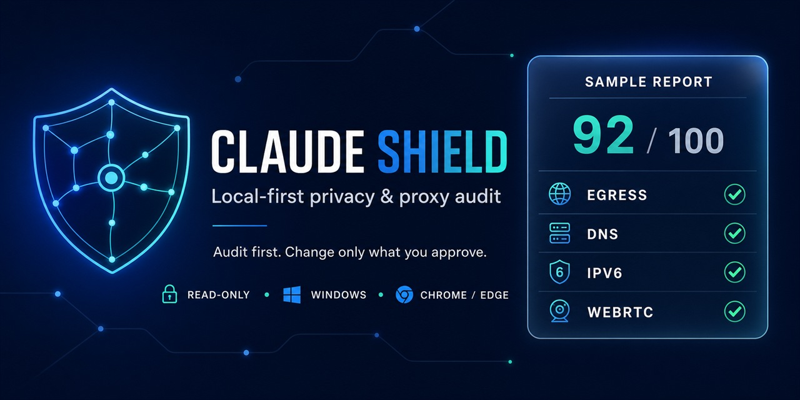

<p align="center">
  
</p>

<h1 align="center">Claude Shield</h1>

<p align="center"><strong>Local-first privacy and proxy-consistency audit for Codex, Claude Code, and Agent Skills hosts.</strong></p>

<p align="center">
  
  
  
  
</p>

<p align="center"><a href="README.zh-CN.md">简体中文</a> · <a href="SKILL.md">Skill instructions</a> · <a href="LICENSE">MIT License</a></p>

> **Audit first. Change only what you approve.**

Claude Shield checks observable network and browser contradictions without spoofing fingerprints, hiding automation, fabricating identity, or promising to bypass platform review.

## Quick start

```powershell
git clone https://github.com/AschoofAlpha/claude-shield.git "$HOME/.codex/skills/anti-claude-check"
```

Invoke `$anti-claude-check` in Codex. For Claude Code, install the same folder as `~/.claude/skills/anti-claude-check` and invoke `/anti-claude-check`.

## What you get

- A full read-only Windows collector for proxy, DNS, IPv6, browser, and documented Claude Code privacy settings, plus a limited POSIX environment summary.
- A bilingual Chrome/Edge page with a transparent 0–100 heuristic score, category bars, findings, LLM-ready text, redacted JSON, and a PNG report.
- Clash Verge/Mihomo checks for rule mode, system proxy, service/TUN state, `strict-route`, fake-IP, DNS hijacking, LAN access, and the actual policy selection when its local controller is available.
- Recommendations split into **Must fix**, **Optional consistency**, and **Leave alone**.
- Optional, reversible privacy environment-variable remediation. No automatic DNS, route, firewall, VPN, IPv6-adapter, device-ID, cache, or browser-fingerprint changes.

The score is local evidence, not a prediction of account approval or suspension.

## Read-only collection

Windows PowerShell 7:

```powershell
pwsh -NoProfile -File .\scripts\collect_windows_network.ps1
```

Windows PowerShell 5.1:

```powershell
powershell.exe -NoProfile -ExecutionPolicy Bypass -File .\scripts\collect_windows_network.ps1
```

macOS or Linux:

```bash
bash ./scripts/collect_posix_network.sh
```

Collector output can contain local identifiers. Keep raw output local and let the Skill redact it before sharing.

## Browser score and image report

Open [`assets/browser-audit.html`](assets/browser-audit.html) in the normal Chrome profile, run the audit, then repeat in Edge. The page:

- reads ordinary browser-provided values without changing them;
- displays an English or Simplified Chinese score and findings;
- exports a CLI-compatible redacted JSON report;
- copies an `ANTI_CLAUDE_BROWSER_REPORT_V1` block for an LLM;
- generates a localized PNG report.

The optional WebRTC test contacts Google's public STUN service once. Raw ICE addresses remain visible only on the local page; exported reports replace them with classifications.

## Optional CLI

```powershell
python -m pip install .
anti-claude-check audit --offline --format json
anti-claude-check browser import .\browser-audit.json
```

`claude-shield` remains as a compatibility command. The wheel includes the collector scripts, browser page, schema, Skill instructions, and bilingual README.

## Privacy opt-outs

Preview first:

```powershell
pwsh -NoProfile -File .\scripts\remediate_windows_network.ps1
```

After explicit approval, apply the documented Claude Code privacy environment variables:

```powershell
pwsh -NoProfile -File .\scripts\remediate_windows_network.ps1 -Apply
```

The script writes a backup and prints the exact rollback command. The broad non-essential-traffic opt-out can disable optional Claude Code features, so enable it only when that tradeoff is intended. On POSIX, `--apply` creates a private environment file and prints the `source` command; it does not edit shell profiles or network settings.

## Safety boundary

- No fingerprint spoofing, automation concealment, CAPTCHA bypass, or multi-account tooling.
- No fabricated identity, residence, billing, tax, or payment information.
- No automatic device-ID deletion, telemetry-cache deletion, or global network modifications.
- No claim that a configuration prevents account review or suspension.

Use current primary documentation for Claude Code privacy controls and rate limits. Treat third-party detector labels as opinions until live routing evidence corroborates them.

If this project finds a real leak or prevents an unnecessary destructive change, a GitHub star helps others discover it.
